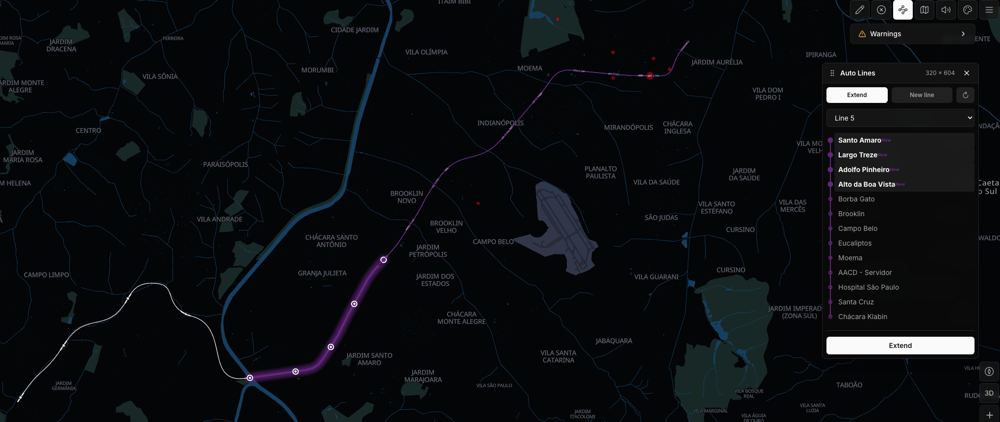
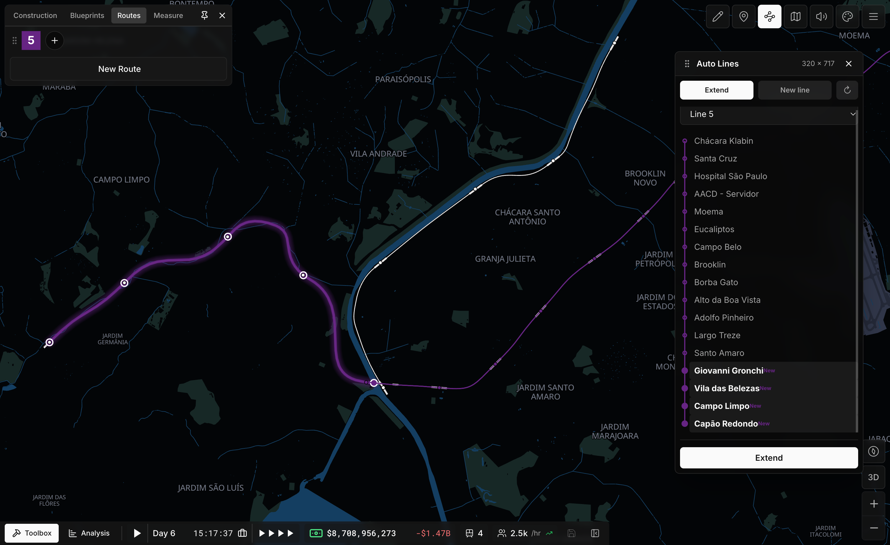
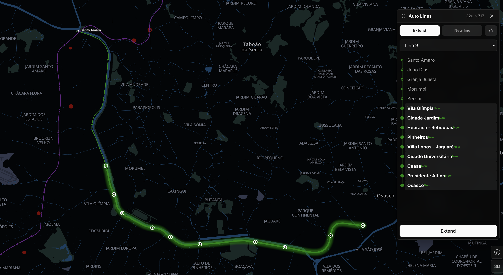
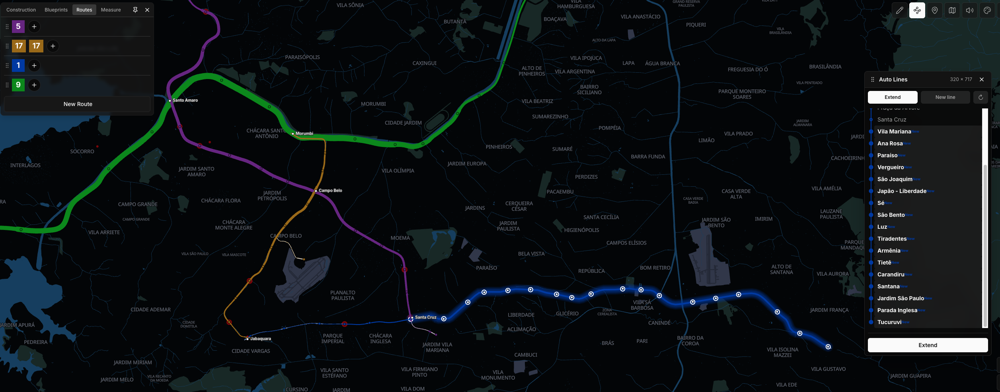
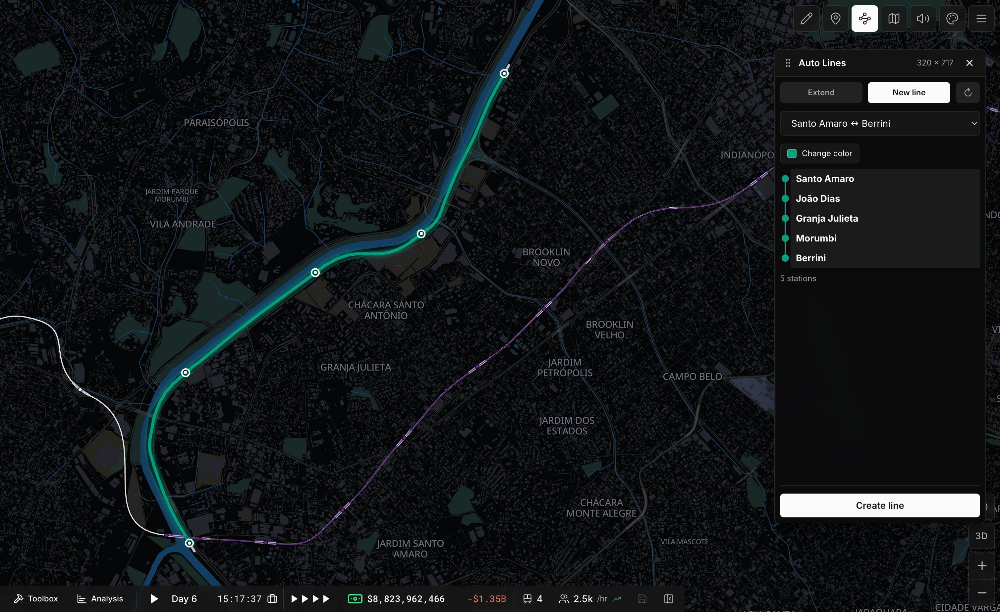

# Auto Lines

[](https://github.com/sponsors/roquerodrigo)

A mod for [Subway Builder](https://www.subwaybuilder.com) that automates building
transit lines: **extend an existing line along its corridor**, or **create a new line
for stations that have none** — each with proper terminus crossovers and demand-based
trains, in a few clicks.

## Install

Install **Auto Lines** from [Railyard](https://subwaybuildermodded.com), or grab the
ZIP from the [latest release](../../releases/latest) and unpack it into
`<game data>/mods/auto-lines/`. Then enable it in **Settings → Mods** and restart the
game. The toolbar button appears once a city is loaded.

## The panel

A toolbar button (icon **Waypoints**) in the top-right actions opens the panel. Four
tabs: **Extend**, **New line**, **Per line** and **Settings**.

### Extend

1. Pick a line from the dropdown. It lists **only the lines that can grow right
   now** — a line already covering its corridor at both ends is left out, so every
   option in it leads somewhere.
2. The panel shows the **whole line** as a vertical list (a dot per station, in the
   line's color), with the stations that would be **added highlighted** at each end.
3. Each end is **walked outward along its corridor**, auto-including single
   continuations until a **bifurcation** (where you choose the branch) or a dead end.
   Stations are added as a single stop at the new terminus and as through-stops in the
   middle — the train never doubles back.
4. Click **Extend** to apply.



Applying a plan moves the terminus, so running **Extend** again picks the corridor up
where it left off — the same Line 5, now offered four more stations out to Capão
Redondo:



The walk has no length cap: Line 9 gains nine stations in a single click, all the way
out to Osasco.



Both ends are planned at once, and a line long enough simply scrolls the list.



### New line

1. The dropdown lists **groups of connected stations that have no line**, labeled by
   the line's terminals ("A ↔ B"). It's hidden when there are none.
2. Pick a group and the panel previews the line it would build: the group's **longest
   corridor**, stopping at bifurcations so a junction becomes a terminus rather than a
   pass-through.
3. Click **Create line**. Lines are numbered 1, 2, 3… A branched group yields one valid
   line; the rest is reported and stays available for another line.



## What it does under the hood

- **Single-stop termini, no backtrack.** A line is a closed loop along tracks; the mod
  lays it so the train reverses cleanly (one platform at each terminus, both in the
  middle), never running through a junction or stopping twice at an end.
- **Turnaround crossovers.** Without a crossover at a terminus the game throws "No
  valid path found between station tracks". The mod fabricates a reversable
  scissors-crossover diagonal at each terminus when one is missing, so trains can
  reverse.
- **Demand-based trains.** On create/extend it puts full ten-car trains on the line
  (or as many cars as the train type takes) and sets its `trainSchedule` for
  5 / 15 / 30 / 60-minute headways (peak / midday / off-peak / night) — computed from
  the round-trip time those trains make — then spawns the current period's trains;
  the game auto-spawns the rest as the time of day changes.
- **Free rolling stock.** A line only runs if the game has the cars and the fleet cap
  for it, so the mod tops both up for free whenever they fall short — no purchase, no
  money spent, and no "Not enough train cars" wall when lengthening a train.
- **Service settings.** The **Settings** tab tunes all of it in-game: cars per train,
  the headway of each period, and a switch that turns the whole thing off — with it
  off, lines are still built and extended, they just come without trains. Settings
  apply to the next line built or extended and survive a reload of the game.
  **Apply to every line** puts them on the whole city at once, for the lines built
  before you settled on your numbers.
- **Per-line service.** The **Per line** tab gives a single line its own train length
  and headways, and shows what it actually runs today beside them. A line served this
  way keeps its own service when it is later extended; typing the city-wide numbers
  back in puts it on those again.

None of this is in the public API. See
[`docs/game-internals.md`](docs/game-internals.md) for the exact mechanisms.

## Development

Requires Node. The dev scripts are macOS-only (they use the macOS app paths).

```bash
npm install
npm run install-mod    # build + copy the mod into the game
npm run debug          # relaunch the game with DevTools + a CDP port
npm run play           # install-mod, then debug
npm run package        # build the release assets into dist/release/
npm test               # vitest run
npm run test:coverage  # vitest + coverage (90% floor)
npm run typecheck      # tsc --noEmit (strict)
npm run lint           # eslint .
```

```
subway-builder-auto-lines/
├── src/                  # the mod, in TypeScript (bundled to one index.js)
│   ├── manifest.json
│   ├── main.tsx          #   composition root
│   ├── domain/           #   network, corridors, expansion + new-line planning
│   ├── application/      #   the use cases
│   ├── infrastructure/   #   the only code that touches the game/map/React
│   ├── presentation/     #   the React panel
│   └── shared/game/      #   typed game contracts
├── scripts/              # dev workflow (Node, macOS)
│   ├── build.mjs         #   esbuild → dist/index.js (one IIFE)
│   ├── install-mod.mjs   #   copy the built mod into the game
│   ├── package-release.mjs #  the ZIP + standalone manifest for a release
│   ├── debug.mjs         #   relaunch the game with DevTools + a CDP port
│   └── cdp-eval.mjs      #   evaluate JS in the running renderer (inspection)
├── tests/                # vitest + jsdom, mirrors src/ (90% coverage floor)
├── docs/
│   ├── game-internals.md       # reverse-engineered game internals this mod uses
│   └── inspecting-the-game.md  # how to inspect/drive the running game over CDP
└── package.json
```

API reference: <https://www.subwaybuilder.com/docs/v1.0.0/api-reference>

### Inspecting / driving the running game

`npm run debug` opens a Chrome DevTools Protocol port; `scripts/cdp-eval.mjs`
(`npm run inspect`) evaluates JS in the live renderer. This is how the mod was built
and verified. See [`docs/inspecting-the-game.md`](docs/inspecting-the-game.md).

```bash
node scripts/cdp-eval.mjs 'Object.keys(window.__subwayBuilder_storeCallbacks__.getState())'
```

### Paths & overrides

| Var | Default | Used by |
|---|---|---|
| `SB_DATA_DIR` | `~/Library/Application Support/metro-maker4` | `install-mod` (mod lands in `<dir>/mods/auto-lines/`) |
| `SB_APP` | `/Applications/Subway Builder.app` | `debug` (the `.app` bundle to launch) |
| `SB_DEBUG_PORT` | `9222` | `debug` / `cdp-eval` (Chrome DevTools Protocol port) |

## Known limitations

- macOS-only dev scripts.
- The track/route/train internals are **undocumented** and version-specific; verify
  against a new game version before trusting them.
- New lines can only be made from stations with **no** line; branched groups need one
  line per corridor (run it again for the rest).

## Support

This mod is built and maintained on personal time. If it is useful to you, consider [sponsoring the work](https://github.com/sponsors/roquerodrigo) — it keeps the development, the testing and the releases coming.

## License

[MIT](LICENSE)
